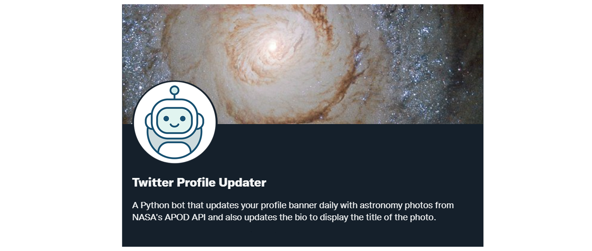

# 🐦 Twitter Profile Updater
This repository contains code to run a Python bot that updates your Twitter profile. It replaces your banner with images obtained from [NASA's Astronomy Picture of the Day API](https://apod.nasa.gov/apod/astropix.html) and you can also utilize it to update your profile bio. It uses the Tweepy library to access the Twitter API.

# 🖥️ Installation Guide
Before starting, you should obtain elevated access to the Twitter API if you do not already have one. You can get it at [Twitter's developers portal](https://developer.twitter.com/). You will also need an API key to use NASA's API. You can generate one by simply filling in your information at [NASA's Open APIs website](https://api.nasa.gov/). You can use other APIs that provide images based on your preference, but you will need to change the code to work.

Clone the repository
```
git clone https://github.com/viniciusenari/twitter-profile-updater
```
Create a virtual environment.
```
python3 -m venv path/to/your-env
```

Activate your virtual environment. On Windows:
```
your-env\Scripts\activate.bat
```

On Unix or MacOS:
```
source your-env/bin/activate
```

Install dependencies
```
pip install -r requirements
```

# 🤖 How to use
Change the name of the [.env_example](https://github.com/viniciusenari/twitter-profile-updater/blob/main/.env_example) file to .env and fill your API's keys and access tokens.
```py
TWITTER_API_KEY="YOUR_TWITTER_API_KEY"
TWITTER_API_KEY_SECRET="YOUR_TWITTER_API_KEY_SECRET"
TWITTER_ACCESS_TOKEN="YOUR_TWITTER_ACCESS_TOKEN"
TWITTER_ACCESS_TOKEN_SECRET="YOUR_TWITTER_ACCESS_TOKEN_SECRET"

NASA_API_KEY="YOUR_NASA_API_KEY"
```
On [app.py](https://github.com/viniciusenari/twitter-profile-updater/blob/main/project/app.py) line 27, change the text variable to your desired Twitter bio. Remember that there is a limit of 160 characters.  
By running [main.py](https://github.com/viniciusenari/twitter-profile-updater/blob/main/main.py) your Twitter profile will be updated.
```
python3 main.py
```
Set up a scheduler to run this script every day and your profile will be updated automatically everyday.